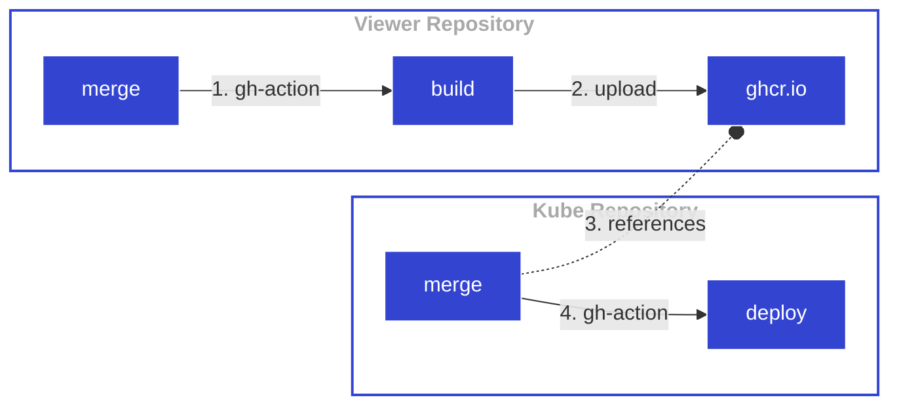

# Deployment process

The deployent process described by this diagram.
The gh-action deploys the image on ghcr.io.

```mermaid
flowchart LR
    classDef default stroke:white,color:#fff,clusterBkg:none,fill:#3344d0
    classDef cluster font-weight: bold,fill:none,color:darkgray,stroke:#3344d0,stroke-width:2px
    classDef subgraph_padding fill:none, stroke:none, opacity:0
    classDef bounded_context stroke-dasharray:5 5

subgraph Viewer Repository
direction LR
merge1[merge] --> |1. gh-action| build -->|2. upload| ghcr.io
end

subgraph Kube Repository
merge2 -.-o|3. references| ghcr.io
merge2[merge] --> |4. gh-action| deploy 
end
```
